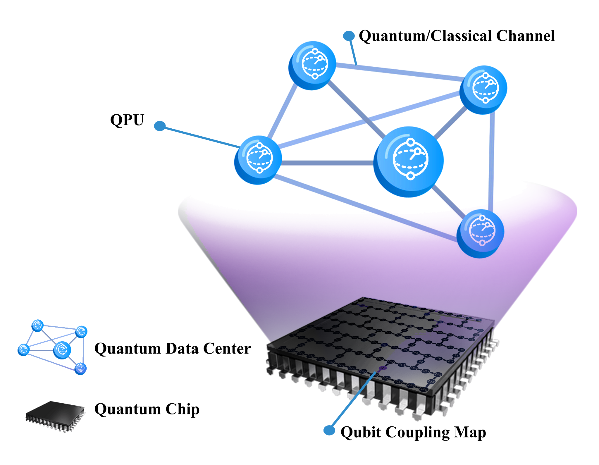
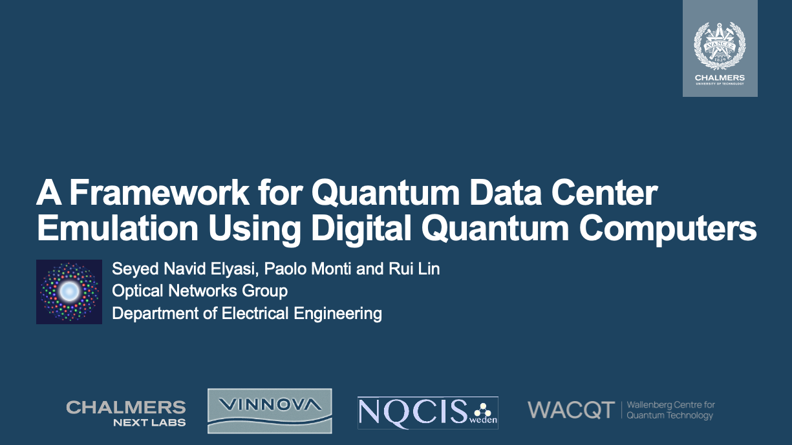
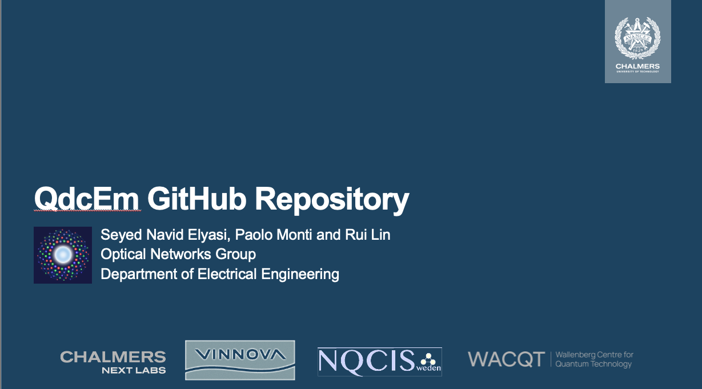

<div align="center">


<br/>


<br/><br/>



<br/><br/>

> **Emulation of Quantum Data Centers on Digital Quantum Computers**
> *Seyed Navid Elyasi · Paolo Monti · Jun Li · Rui Lin — Chalmers University of Technology*

<br/>

</div>

---

## `01` &nbsp; Overview

This repository contains the code, data, and analysis scripts supporting research on **hardware-compatible emulation of Quantum Data Centers (QDCs)** within a single superconducting quantum processor.

The approach partitions a chip's coupling map into **virtual Quantum Processing Units (QPUs)** and uses an experimentally grounded **Collisional Model (CM)** to emulate noisy quantum communication channels — optical fibers and microwave-to-optical transducers — all on a single device.

```
 ┌─────────────────────────────────────────────────────────────┐
 │                    Single Quantum Chip                      │
 │                                                             │
 │   ┌──────────────┐    Fiber + Transducer    ┌─────────────┐ │
 │   │    QPU A     │  ══════════════════════  │    QPU B    │ │
 │   │  P  P  C  E  │  κ_Fiber  κ_Transducer   │  E  C  P  P │ │
 │   └──────────────┘                          └─────────────┘ │
 │                                                             │
 │   P = Processing qubit   C = Communication qubit            │
 │   E = Environment qubit (CM noise injection)                │
 └─────────────────────────────────────────────────────────────┘
```

---

## `02` &nbsp; Key Contributions

| &nbsp; | Contribution | Description |
|:---:|---|---|
| ⚙ | **Remote Gate Implementation** | CNOT, Controlled-Phase, CZ, and Controlled-U gates across virtual QPUs via Cat-Comm and TP1 protocols |
| ∿ | **Collisional Model Noise** | Experimentally grounded noise for fiber attenuation and transducer inefficiency |
| ◈ | **Distributed Algorithms** | Grover's Search and QFT demonstrated across partitioned QPUs |
| ⊞ | **Full Reproducibility** | All IBM Quantum job data and plotting scripts to recreate every figure from the paper |

---

## `03` &nbsp; Repository Structure

```
QdcEm/
│
├── QdcEm/                        # Core package
│   ├── __init__.py
│   ├── QPU.py                    # QPU class and initial layout mapping
│   ├── RemoteGates.py            # Remote gates: CX, CP, CZ, CU (Cat-Comm) + CX (TP1)
│   ├── Algorithms.py             # Distributed Grover's search and 5-qubit QFT
│   └── Representation.py        # Circuit visualization utilities
│
├── Example/
│   ├── Example1_BellPair_Fidelity_Landscape.ipynb
│   └── Example2_Protocol_Race_CatComm_vs_TP1.ipynb
│
├── Jobs/                         # IBM Quantum job results from paper experiments
│   ├── Cat-C0/                   # Cat-Comm protocol, control qubit |0⟩
│   ├── Cat-C1/                   # Cat-Comm protocol, control qubit |1⟩
│   ├── TP1-C0/                   # Teleportation Protocol 1, control qubit |0⟩
│   ├── TP1-C1/                   # Teleportation Protocol 1, control qubit |1⟩
│   ├── Grover/                   # Distributed Grover's search jobs
│   └── QFT/                      # Distributed QFT jobs
│
├── Calibration_Data/             # IBM device calibration snapshots (JSON)
├── QubitSets/                    # Qubit selection CSVs and IBM Toronto topology map
├── Plots/                        # Pre-generated paper figures (Fig5a–d, Fig6, Fig9)
├── Pics/                         # Architecture diagrams and result visualizations
├── Tutorial/                     # Tutorial thumbnails and links
├── docs/                         # ReadTheDocs documentation source
│
├── Main.ipynb                    # End-to-end workflow notebook
├── generate_plots.py             # Reproduce all paper figures from job data
└── requirements.txt              # Python dependencies
```

---

## `04` &nbsp; Noise Model

$$\hat{H} = \kappa \left( \sigma^- \otimes \sigma^+ + \sigma^+ \otimes \sigma^- \right)$$

The Collisional Model (CM) implements this interaction Hamiltonian between the flying qubit and a single environment ancilla, producing the unitary $U = \exp(-i\hat{H})$ per collision step. Environment qubits are reset between steps to enforce the Markovian (memory-less) assumption.

| Parameter | Symbol | Description |
|-----------|--------|-------------|
| Transducer coupling | `κ_Transducer` | Microwave-to-optical conversion inefficiency (`κ_T = 0.5`) |
| Fiber coupling | `κ_Fiber` | Optical attenuation per 10 m segment (`κ_F = √(0.01·α)`) |
| CM steps | `Steps` | Additional fiber collision steps; total distance = `10·(1 + Steps)` m |

Supported fiber types and their attenuation coefficients (dB/km):

| Fiber Type | α (km⁻¹) |
|------------|-----------|
| G-652-D    | 0.0415    |
| G-654-E    | 0.0392    |
| G-655-D    | 0.0507    |

---

## `05` &nbsp; Installation

```bash
pip install qiskit==2.3.0 qutip==5.2.3 matplotlib==3.10.8 numpy==2.4.2
```

Or install all dependencies at once via the provided requirements file:

```bash
pip install -r requirements.txt
```

For IBM Quantum hardware execution, also install:

```bash
pip install qiskit-ibm-runtime qiskit-aer
```

---

## `06` &nbsp; Quick Start

**Set up QPUs and run a remote CNOT (Cat-Comm protocol):**

```python
from qiskit.circuit import QuantumCircuit, QuantumRegister, ClassicalRegister
from QdcEm.RemoteGates import remote_cx
from QdcEm.QPU import Make, Get_Initial_Layout

# Define QPUs: each QPU has a communication qubit, an environment qubit,
# and one or more processing qubits
QPU_A = Make(Comm=2, EN=3, Processing_Qubits=[0, 1])
QPU_B = Make(Comm=4, EN=5, Processing_Qubits=[6, 7])

# Build circuit
qr = QuantumRegister(8, 'q')
cr = ClassicalRegister(4, 'c')
qc = QuantumCircuit(qr, cr)

# Apply noisy remote CNOT across QPUs
remote_cx(
    qc,
    control=qr[0],           # processing qubit in QPU A
    target=qr[6],            # processing qubit in QPU B
    CommA=qr[2],             # communication qubit in QPU A
    CommB=qr[4],             # communication qubit in QPU B
    ENA=qr[3],               # environment qubit in QPU A (CM noise)
    ENB=qr[5],               # environment qubit in QPU B (CM noise)
    creg=cr,
    creg_index=0,
    kappa_Fiber=0.0198,      # G-654-E fiber: sqrt(0.01 * 0.0392)
    Steps=3,                 # 4 × 10 m = 40 m total fiber
    kappa_Transductor=0.5
)
```

**Run the distributed algorithms:**

```python
from QdcEm.Algorithms import grover_2qubit_annotated_Distributed, qft_5qubit_annotated_Distributed

# Distributed 2-qubit Grover's search (mark state '11')
qc_grover = grover_2qubit_annotated_Distributed(
    marked_states=['11'],
    kappa_Fiber=0.0198,
    Steps=0,
    kappa_Transductor=0.5
)

# Distributed 5-qubit QFT
qc_qft = qft_5qubit_annotated_Distributed(
    Steps=0,
    kappa_Fiber=0.0198,
    kappa_Transductor=0.5
)
```

**Reproduce all paper figures from stored IBM Quantum job data:**

```bash
python generate_plots.py
# Outputs saved to Plots/: Fig5a–d, Fig6, Fig9
```

**Explore interactive examples:**

```
Example/Example1_BellPair_Fidelity_Landscape.ipynb   # Bell pair fidelity vs. fiber length
Example/Example2_Protocol_Race_CatComm_vs_TP1.ipynb  # Cat-Comm vs. TP1 fidelity comparison
```

---

## `07` &nbsp; Demonstrated Algorithms

<table>
<tr>
<td width="33%" valign="top">

**🔵 &nbsp; Grover's Search**

Distributed 2-qubit Grover's algorithm across virtual QPUs, validated against ion-trap experimental results. The oracle uses a remote CZ gate; the diffusion operator uses a remote CX gate.

</td>
<td width="33%" valign="top">

**🟣 &nbsp; Quantum Fourier Transform**

5-qubit QFT partitioned across QPUs (QPU A: 2 qubits, QPU B: 3 qubits) with four cross-QPU remote controlled-phase gates. Qubit reordering eliminates the SWAP layer.

</td>
<td width="33%" valign="top">

**🔴 &nbsp; Bell Pair Fidelity**

Cross-QPU Bell state fidelity as a function of fiber length and fiber type, benchmarked for both Cat-Comm and TP1 protocols across four ITU fiber standards.

</td>
</tr>
</table>

---

## `08` &nbsp; Dependencies

| Package | Version | Role |
|---------|---------|------|
| [qiskit](https://qiskit.org/) | `2.3.0` | Circuit construction and execution |
| [qutip](https://qutip.org/) | `5.2.3` | Collisional model unitary simulation |
| [matplotlib](https://matplotlib.org/) | `3.10.8` | Figure plotting |
| [numpy](https://numpy.org/) | `2.4.2` | Numerical computation |
| [qiskit-ibm-runtime](https://github.com/Qiskit/qiskit-ibm-runtime) | — | IBM Quantum hardware execution |
| [qiskit-aer](https://github.com/Qiskit/qiskit-aer) | — | Local Aer simulator |

---

## `09` &nbsp; Tutorials

<table>
<tr>
<td width="50%" align="center" valign="top">

### Concepts, Theory, and Paper Background

<a href="https://youtu.be/hbQn5vrRxDE">
  
</a>

<br/>

<a href="https://youtu.be/hbQn5vrRxDE">
  Watch Tutorial
</a>

</td>
<td width="50%" align="center" valign="top">

### How to Use the Repository

<a href="https://youtu.be/F_b91hB_YSM">
  
</a>

<br/>

<a href="https://youtu.be/F_b91hB_YSM">
  Watch Tutorial
</a>

</td>
</tr>
</table>

Full API documentation is available at **[qdcem.readthedocs.io](https://qdcem.readthedocs.io/en/latest/index.html)**.

---

## `10` &nbsp; Citation

```bibtex
@article{elyasi2025quantum,
  title   = {A Framework for Quantum Data Center Emulation Using Digital Quantum Computers},
  author  = {Elyasi, S. N. and Monti, P. and Li, J. and Lin, R.},
  journal = {arXiv preprint arXiv:2509.04029},
  year    = {2025},
  url     = {https://arxiv.org/abs/2509.04029}
}
```

---

<div align="center">

Made at **Chalmers University of Technology**


</div>
