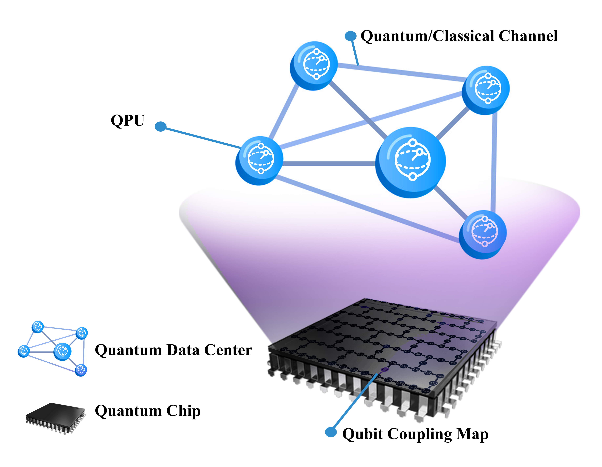

QdcEm: Quantum Data Center Emulator
=====================================

.. image:: https://img.shields.io/badge/License-MIT-brightgreen.svg
   :target: ./LICENSE

.. image:: https://img.shields.io/badge/version-1.0-brightgreen.svg

.. image:: https://img.shields.io/badge/arXiv-2509.04029-red
   :target: https://arxiv.org/abs/2509.04029

.. image:: https://img.shields.io/badge/Qiskit-2.4.1-6929C4
   :target: https://qiskit.org

**A hardware-compatible framework for emulating Quantum Data Centers on
single-chip superconducting quantum processors.**

This open-source project provides the complete implementation supporting
the paper:

   *"A Framework for Quantum Data Center Emulation Using Digital Quantum
   Computers"* — S. N. Elyasi, P. Monti, J. Li, R. Lin —
   `arXiv:2509.04029 <https://arxiv.org/abs/2509.04029>`__ (2025)

QdcEm partitions a real quantum processor's coupling map into **virtual
Quantum Processing Units (QPUs)** and introduces an experimentally
grounded **Collisional Model (CM)** to emulate optical quantum
communication channel noise — transducers and fiber segments — with
tunable, physically motivated parameters. The result is a
self-contained emulation environment for distributed quantum computing
that runs entirely within a single chip.

QdcEm includes hardware-compatible implementations for:

- Remote gate protocols (Cat-State Communication and Teleportation)
  across virtual QPU boundaries,
- CM-based noise injection for transducer-induced and fiber-induced
  decoherence,
- Distributed quantum algorithms — Bell-state generation, Grover's
  Search, and the Quantum Fourier Transform, and
- All plotting scripts to recreate the figures from the paper.

.. list-table::
   :widths: 20 80

   * - **GitHub**
     - https://github.com/nelyasi/QdcEm
   * - **arXiv**
     - https://arxiv.org/abs/2509.04029
   * - **License**
     - MIT
   * - **Tutorial notebook**
     - ``Main.ipynb``

----

.. toctree::
   :maxdepth: 1
   :caption: Introduction

   pages/install

.. toctree::
   :maxdepth: 2
   :caption: Tutorials

   pages/tutorials/quickstart
   pages/tutorials/noise_model
   pages/tutorials/algorithms
   pages/tutorials/examples

.. toctree::
   :maxdepth: 2
   :caption: API Reference

   pages/api
   pages/modules/remotegates
   pages/modules/qpu
   pages/modules/algorithms_module
   pages/modules/representation

.. toctree::
   :maxdepth: 1
   :caption: Development

   pages/how_to_cite
   pages/authors
